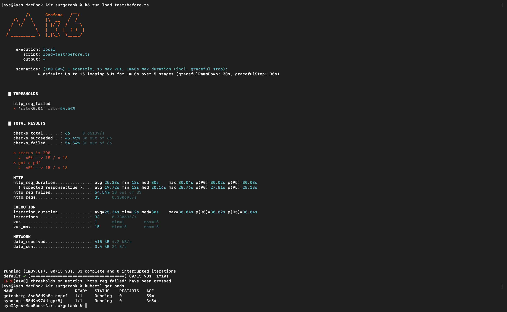
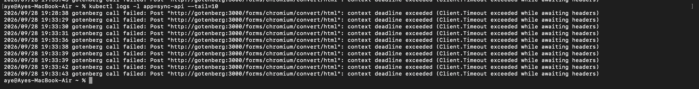
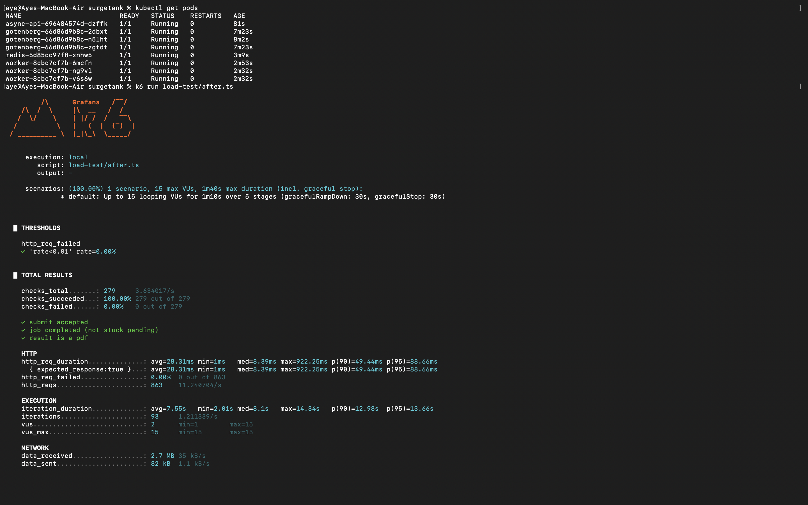
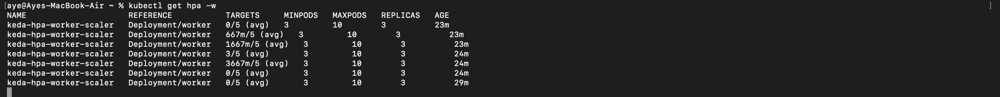

# Surgetank

Queue-based load leveling for PDF generation — fixing a timeout/resource issue by moving heavy rendering work off the request path.

This reproduces an issue I hit at a previous job: PDF/quotation generation via [Gotenberg](https://gotenberg.dev/), called synchronously, failing under concurrent load. The original fix there was scaling up CPU/memory — which raises the failure ceiling but doesn't remove it. This project rebuilds the problem and fixes it properly.

## Architecture

**Before** — synchronous, direct call:
```
Agent → sync-api → Gotenberg (blocks until render finishes)
```

**After** — async, queue-based, autoscaled:
```
Agent → async-api → Redis queue (returns instantly)
                          ↓
                  worker (KEDA-autoscaled) → Gotenberg

Agent polls /status/:id, downloads /result/:id once done
```

Redis stands in locally for AWS SQS + S3 — a simplification for local development on `kind`.

## Results

Same load profile (ramp to 15 concurrent VUs) for both stacks:

**Before:** 54.54% of requests failed. Failures were client-side timeouts. Requests are queuing up behind each other on a single synchronous Gotenberg call.




**After:** 100% success — `submit accepted`, `job completed`, `result is a pdf` all pass.




## The debugging journey

Getting a result took a few real fixes along the way:

1. **Scaling workers alone recreated the same bottleneck.** 3 `worker` pods hitting a single Gotenberg replica caused CPU contention.
Fix: scale Gotenberg's replica count too, not just the consumer.
2. **KEDA's scaling slow reaction time (~70-90s) caused incomplete jobs during short bursts,** even though nothing failed outright, a characteristic of reactive autoscaling.
3. **Fix: pre-warm baseline capacity.** Keeping 3 workers running at all times, so there's no wait for new pods to spin up. Running the exact same test again, the one that used to fail 34% of the time - now passes 100%.

Same idea as keeping spare servers warm to avoid cold starts elsewhere (like Karpenter provisioning nodes) — you pay a bit extra for idle capacity, but respond to bursts instantly instead of delaying.

## Tech stack

- **Go** — `sync-api`, `async-api`, `worker`
- **Gotenberg** — PDF rendering (headless Chromium)
- **Redis** — job queue + result storage (local stand-in for SQS/S3)
- **Kubernetes** (`kind` locally) — Deployments, Services, resource limits
- **KEDA** — autoscaling `worker` on Redis queue depth
- **k6** (TypeScript) — load testing, before/after comparison

## Running it locally

```bash
kind create cluster --config kind/cluster-config.yaml

# Before stack
docker build -t sync-api:v1 docker/sync-api
kind load docker-image sync-api:v1 --name surgetank
kubectl apply -f k8s/before/

# After stack
docker build -t async-api:v1 docker/async-api
docker build -t worker:v1 docker/worker
kind load docker-image async-api:v1 --name surgetank
kind load docker-image worker:v1 --name surgetank
kubectl apply -f k8s/after/

# KEDA
helm repo add kedacore https://kedacore.github.io/charts
helm install keda kedacore/keda --namespace keda --create-namespace
kubectl apply -f k8s/after/worker-scaledobject.yaml

# Load tests
k6 run load-test/before.ts
k6 run load-test/after.ts
```
